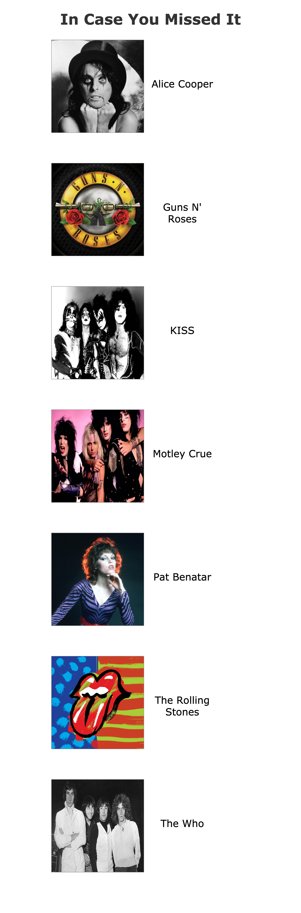
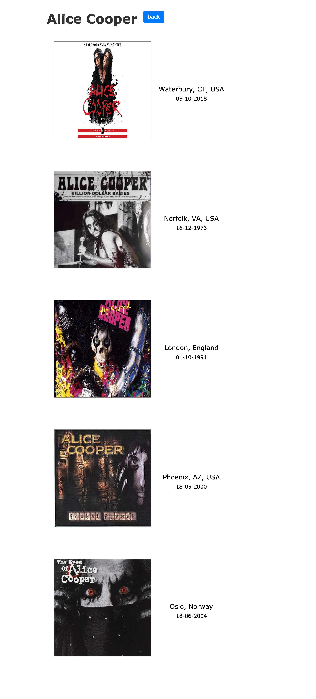
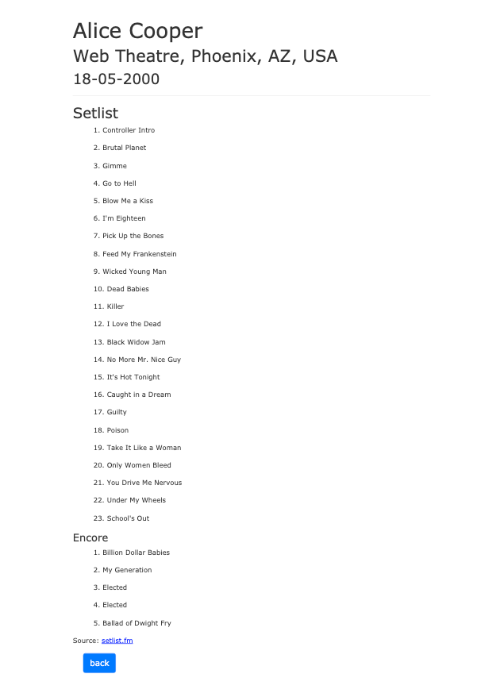

# In Case You Missed It

https://in-case-you-missed-it.herokuapp.com/

Do you ever want to know what you missed by not going to that concert? In Case You Missed It provides you with the setlist from that magical show. This project came with a lot of challenges. This was the first project I did that isn't JavaScript based. It took some time to get comfortable with the syntax and structure. I learned a lot about the importance of research and development during these past couple of weeks. If I had more time I would seed some more data and style it a bit more. I would also change the structure of the date. I had to leave it as dd-mm-yyy for the time being since that is the structure that the Setlist.fm API recognizes.

---

## Technologies I Used

- Ruby on Rails
- ERB
- PostgreSQL
- CSS 3
- Setlist.fm API
- Bootstrap

